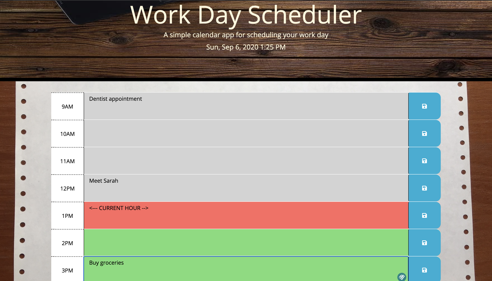

# Daily Planner 2020 :calendar:

Wherever you are heading to this year, you may enjoy this simple & handy _**work day scheduler**_...

### GitHub Page with [Live Version!](https://piotr72us.github.io/dailyPlanner2020/index.html)

### Programming Languages Used:
---
* `JavaScript`: 35%
  * including $jQuery and moments.js
* `CSS`: 16%
* `HTML`: 49%

### About this application:
---
+ When you open this page, you will see **the current date and time** displayed in the header.
+ Below, there is a work day scheduler with time slots for standard business hours **(9AM - 5PM)** and input fields to help you keep track of your daily tasks.
+ Click the **"save" icon** to save your tasks and to access them later.
+ **Time blocks change color** based on the current time: gray = past hour/s, red = current hour, green = hour/s ahead

Rest assured knowing that you **will not miss an important event** any more!

### Quick glance at the Daily Planner 2020:
---

