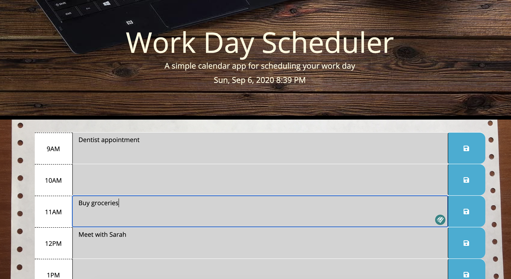

# Daily Planner 2020 :calendar:

Wherever you are heading to this year, you may enjoy this simple & handy work day scheduler...
 
### GitHub Page with Live Version: https://piotr72us.github.io/dailyPlanner2020/index.html
 
### Programming Languages Used:

+ JavaScript
 
    (including `$jQuery` and `moments.js`)
+ CSS
+ HTML
 
### About this application
+ When you open this page, you will see current date and time displayed in the header.
+ Below, there is a work day scheduler with time slots for standard business hours (9AM - 5PM) and input fields to help you keep track of your daily tasks.
+ Click the "save" icon to save your tasks and to access them later.
+ Time blocks change color based on the current time:
 
gray = past hour/s
 
red = current hour
 
green = hour/s ahead
 

Rest assure knowing that you will not miss an important event any more!
 

### Quick glance at the Daily Planner 2020:

